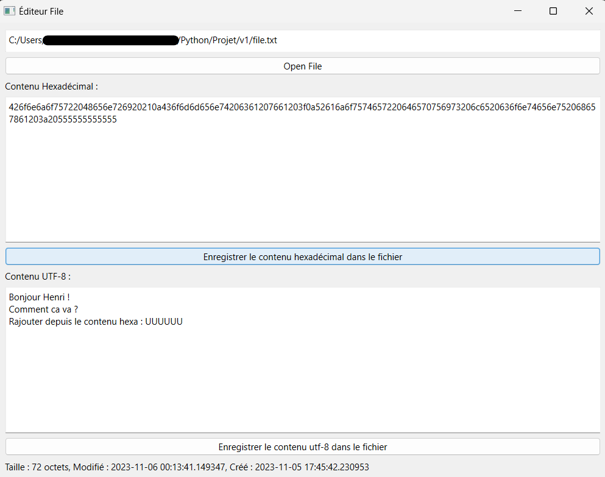
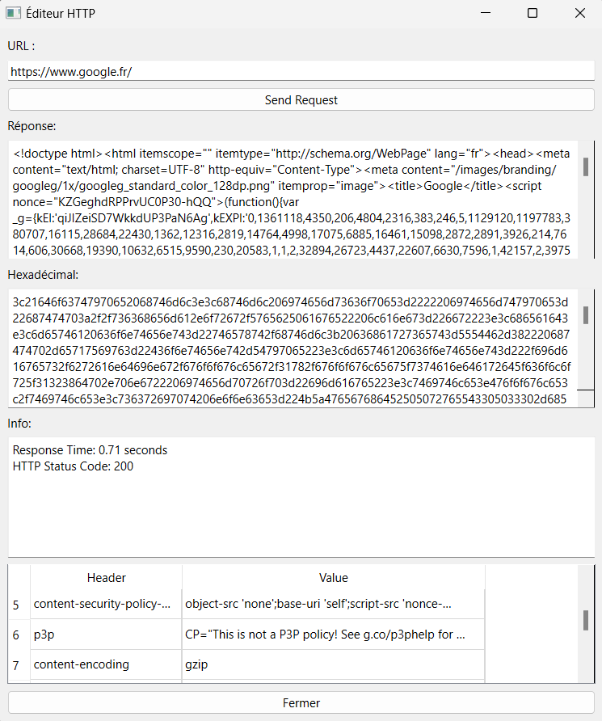

# Projet Éditeur et Visionneur Hexadécimal

Ce projet Python utilise les bibliothèques PySide6, Pillow et Request pour créer un éditeur et un visionneur hexadécimal. Le programme propose trois modes :

1. Éditeur Hexadécimal de Fichiers.
2. Éditeur Hexadécimal d'Images.
3. Visionneur de Requêtes HTTP.

Chaque mode a sa propre fenêtre conçue pour répondre aux besoins spécifiques. Voici un aperçu visuel de ces fenêtres :

**Mode Éditeur Hexadécimal de Fichiers :**


**Mode Éditeur Hexadécimal d'Images :**


**Mode Visionneur de Requête HTTP :**


## Installation

Pour utiliser ce programme, assurez-vous d'avoir installé les bibliothèques requises : PySide6, Pillow et Requests. Vous pouvez les installer à l'aide de pip :

```bash
pip install PySide6 Pillow requests
```

## Utilisation

Pour exécuter le programme, suivez ces étapes :

1. Assurez-vous d'avoir installé les bibliothèques mentionnées précédemment.
2. Ouvrez un terminal.
3. Naviguez vers le répertoire du projet.
4. Exécutez le fichier `edit_main.py` en utilisant Python :

```bash
python ./edit_main.py
```

Cela ouvrira une fenêtre de sélection du mode, où vous pourrez choisir entre l'éditeur hexadécimal de fichiers, l'éditeur hexadécimal d'images ou le visionneur de requêtes HTTP.

## Problème de Visualisation des Images

Il est important de noter qu'il existe un problème lié à la visualisation des images. Actuellement, je n'ai pas trouvé de méthode convaincante pour limiter la taille des images sans les redimensionner dans la fenêtre. Par conséquent, la qualité de visualisation dépend de la taille de départ de l'image. Les grandes images peuvent présenter une qualité moins bonne que les petites.